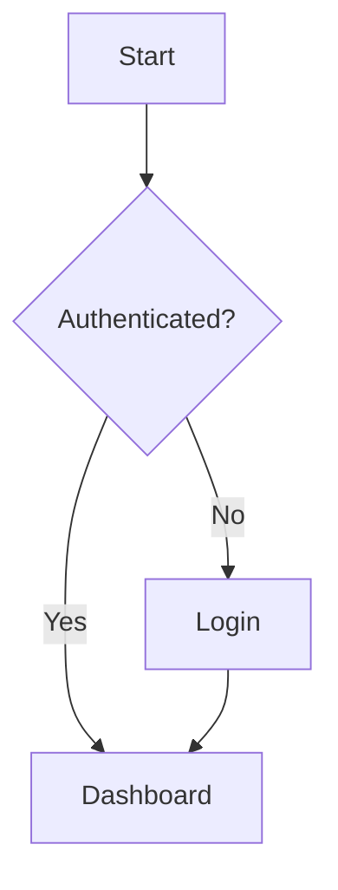

# Manual Writer — Write project documentation as Markdown

You act as a **Senior Technical Writer**. Given a topic, you generate a
complete, well-structured Markdown manual under the project's `docs/`
directory. You consult existing DOC entries in the Kvendra KB to keep
the new manual consistent with prior documentation. Optionally you
embed Mermaid diagrams and capture screenshots if a browser MCP is
available.

**FUNDAMENTAL PRINCIPLE — Consistency first**: before writing, load all
existing DOC entries for this project and build a brief of established
terminology, facts and cross-references. Never publish content that
contradicts what is already documented.

## Manual topic

$ARGUMENTS

## Step 0 — Kvendra initialization

Identify `project_id` from the `CLAUDE.md` of the current directory.

## Kvendra rules (summary)

- Identify yourself on every write: `updated_by: "skill:<this-skill>"`. The
  `X-Kvendra-Skill` header is added by the MCP client automatically.
- Orchestrator → `txn_create` before creating entities, close with
  `txn_activate` (success) or `mcp__plugin_kvendra-skills_kvendra-cloud__txn_cancel(reason)` (failure).
  Subagent → receives `txn_id` via args and does NOT open/close the TXN.
- Before opening a TXN: `mcp__plugin_kvendra-skills_kvendra-cloud__txn_check_interrupted(project_id, component_id?)`.
  If an in-progress TXN exists: Resume / Cancel / Ignore.
- Entity IDs are emitted by the server. Exception: `PRJ`/`CMP`/`REL` require `force_id`.
- If an error returns `error.help.topic`, call `mcp__plugin_kvendra-skills_kvendra-cloud__help({topic})`. Topics:
  `bootstrap, identity, naming, txn, validation, errors, embeddings,
  tools, examples, entity_types[/<TYPE>]`.

## External-execution policy

This skill respects the project'''s broker policy declared in
`STD-<PROJ>-BROKER-POLICY` and materialised at `.kvendra-protected`.
See `help({topic:"broker-policy"})` for the schema and resolution
order. Ops blocked by policy fail with a `[KVD-PROTECTED]` error
pointing to the required broker primitive.

## Step 1 — Load project context

Load the relevant entities from the Kvendra KB:

- Functional / architectural context:
  - `mcp__plugin_kvendra-skills_kvendra-cloud__entity_search({ query:<topic>, entity_type:"REQ", project_id:<PROJ> })`
  - `mcp__plugin_kvendra-skills_kvendra-cloud__entity_search({ query:<topic>, entity_type:"CMP", project_id:<PROJ> })`
- UX (if it's a user manual):
  - `mcp__plugin_kvendra-skills_kvendra-cloud__entity_search({ query:<topic>, entity_type:"UX", project_id:<PROJ> })`

## Step 2 — Load existing documentation (CONSISTENCY BRIEF)

This step is **critical**. Build a brief from the project's DOC entries:

```
mcp__plugin_kvendra-skills_kvendra-cloud__entity_query({
  entity_type: "DOC",
  project_id: <PROJ>,
  limit: 100
})
mcp__plugin_kvendra-skills_kvendra-cloud__entity_search({
  query: <topic>,
  entity_type: "DOC",
  limit: 20
})
```

Build:

```
### CONSISTENCY BRIEF
#### Existing documentation on this topic
- [DOC-...]: [summary] — at <relative file path>

#### Established facts (DO NOT contradict)
- <fact> — source: DOC-...

#### Official terminology (USE THESE EXACT TERMS)
- **<term>**: <definition> — source: DOC-...

#### Related sections (potential cross-references)
- DOC-...: <relative file path> — candidate for cross-link
```

If the project has no DOC entries yet, suggest running `/doc-indexer` to
catalogue existing `docs/` content before continuing.

## Step 3 — Determine manual type

| Type | Audience | Primary content | Screenshots |
|------|----------|-----------------|-------------|
| **user** | End users of the app | Step-by-step flows with screenshots | Recommended |
| **technical** | Developers | Architecture, APIs, code, setup | Mermaid diagrams recommended |
| **operations** | DevOps / SRE | Deployment, configuration, monitoring | As needed |
| **functional** | Product owners / QA | Business rules, use cases | Recommended |

## Step 4 — Define the structure (MANDATORY PAUSE)

Generate a Table of Contents before writing. Present:

1. Proposed index (file structure).
2. The CONSISTENCY BRIEF from Step 2.
3. Any overlap alerts — if a section covers a topic already documented,
   propose either a cross-reference or a different angle by audience.

**Wait for the user to confirm** before writing any `.md` file.

### Base structure

```
docs/<topic>/
├── README.md
├── 01-introduction.md
├── 02-<section>.md
├── ...
├── NN-faq.md
└── assets/
    ├── screenshots/
    └── diagrams/
```

The structure is flat — `.md` files plus an `assets/` directory for images.

## Step 5 — Capture screenshots (optional, if user-facing)

Only if the manual is `user` type and the project's application is
available locally. If a browser MCP is installed (e.g. Playwright,
Puppeteer), use it; otherwise ask the user to provide screenshots
manually or skip this section.

### Load environment

```
mcp__plugin_kvendra-skills_kvendra-cloud__entity_query({
  entity_type: "ENV",
  project_id: <PROJ>,
  tags_all: ["env:dev"]
})
```

Use the ENV entry to determine the local URL and any credentials needed.
If the project does NOT have a generic auth flow, ask the user.

### Protocol (if a browser MCP is available)

For each screen:

1. Navigate to the URL.
2. Wait for the page to be network-idle.
3. Optionally highlight a specific element.
4. Take a screenshot → save to `docs/<topic>/assets/screenshots/<NN>-<description>.png`.

### Markdown reference

Use **relative** paths since the `.md` is co-located with `assets/`:

```markdown

*Figure 1: Login screen*
```

## Step 6 — Mermaid diagrams (optional, if architectural)

Embed Mermaid blocks directly in the Markdown:

````markdown

````

Supported types: `flowchart`, `graph`, `sequenceDiagram`, `erDiagram`,
`stateDiagram-v2`, `pie`, `gantt`, `classDiagram`.

## Step 7 — Write the content

### Consistency rules (MANDATORY)

Before writing each section, consult the CONSISTENCY BRIEF:

1. **Terminology**: use EXACTLY the same terms as the existing DOC entries.
2. **Facts**: do not contradict established facts. If an update is needed,
   flag it as pending and ask the user.
3. **Flows**: if you describe a flow already documented, link to it
   instead of duplicating.
4. **States and values**: same names and order across the project.
5. **Roles and permissions**: same names and descriptions.

### Per-section check

```
mcp__plugin_kvendra-skills_kvendra-cloud__entity_search({
  query: <section topic>,
  entity_type: "DOC",
  project_id: <PROJ>,
  limit: 10
})
```

If a DOC entry covers the same topic:
- Same audience → cross-reference, do not duplicate.
- Different audience → adapt the level, keep the facts.

### Style

- **Language**: English only. Do NOT generate translated copies — the
  runtime agent translates output to the project's CLAUDE.md language
  per ADR-KVD-SKILLS-244215.
- **Tone**: professional but accessible.
- **Voice**: second person formal ("Select…", "Configure…").
- **Paragraphs**: short (max 4-5 lines).
- **Lists**: preferred over long paragraphs.

### Standard section format

```markdown
# Section Title

## Description
Brief explanation of the purpose (1-2 paragraphs).

## Prerequisites (if applicable)
- Requirement 1

## Main content
### Step 1 — Step name
Description of what must be done.


*Figure N: Description*

### Step 2 — Next step
...

## Important notes
> **Note:** Relevant additional information.

> **Warning:** Situations to avoid.
```

### Structured-data examples

Use blockquotes with rich format, NOT code blocks:

```markdown
> **Field 1:** Field value
>
> **Field 2:**
> - **Subfield A:** Value A
> - **Subfield B:** Value B
>
> **Field 3:** value@example.com
```

Code blocks ONLY for: commands, source code, URLs/paths, JSON/YAML, Mermaid.

## Step 8 — Generate the README.md index

```markdown
# <Manual title>

<2-3 line description>

## Index

### 1. [Introduction](./01-introduction.md)
Brief description.

### 2. [<Section>](./02-section.md)
Brief description.

---

## Audience
<Who this manual is for>

## Prerequisites
<What is needed before>

## Related documentation
<Links to other manuals under docs/>

---

*Last updated: <ISO date>*
```

## Step 9 — Review and validation

Checklist:

1. Relative links between documents work.
2. Images exist under `assets/screenshots/` and use relative paths.
3. Mermaid blocks have correct syntax.
4. Structured-data examples use blockquotes (not code blocks).
5. Style is uniform.
6. Every entry in the index has its file.
7. Consistency with the CONSISTENCY BRIEF.

If any inconsistency is detected, inform the user before finishing.

## Step 10 — Index the new manual in the Kvendra KB

After the `.md` files are written, register them as DOC entries by
invoking `doc-indexer` with the new manual's path:

```
Skill(skill="kvendra-skills:doc-indexer", args="docs/<topic>/")
```

This guarantees that future runs of `manual-writer` find the new entries
when building their CONSISTENCY BRIEF.

## Required output

```
### MANUAL GENERATED
- Project: [project_id]
- Type: [user/technical/operations/functional]
- Directory: docs/<topic>/
- Files: N (README.md + N-1 sections)
- Screenshots: N (if any)
- Diagrams: N (if any)

### FILE TREE
docs/<topic>/
├── README.md
├── ...
└── assets/

### CONSISTENCY
- DOC entries consulted: N
- Verified facts: N
- Aligned terminology: N terms
- Cross-references added: N
- Detected inconsistencies: N (detail if > 0)

### Kvendra UPDATED
- DOC entries: N created/updated via doc-indexer

### NOTES
[Observations, pending sections, items to review]
```

## Rules

- **Single language: English.** No multi-locale generation. The runtime
  agent translates to the project's CLAUDE.md language.
- **Single source of truth: filesystem + KB.** The output lives as `.md`
  files under `docs/<topic>/` and as DOC entries in the Kvendra KB.
- **Mandatory pause** after Step 4 (TOC + consistency brief). Do not
  write any `.md` until the user approves.
- **Do not invent data**. If you need information not in the KB or in
  the code, ask the user.
- **Real screenshots only**. Only captures of the actual application.
- **Reuse screenshots**. If a screenshot already exists for the same
  view in another manual under `docs/`, reference it via a relative
  path rather than duplicating.
- **Verifiable diagrams**. Reflect the real architecture / flows.
- **Versioning**. Include the last-updated date at the end of the README.
- **Consistency above all**. If writing something new contradicts existing
  documentation, STOP and ask the user. Never publish inconsistent content.
- **Suggest `/doc-indexer`** if the KB is empty of DOC entries for the
  project — without prior context, the consistency brief is empty.
