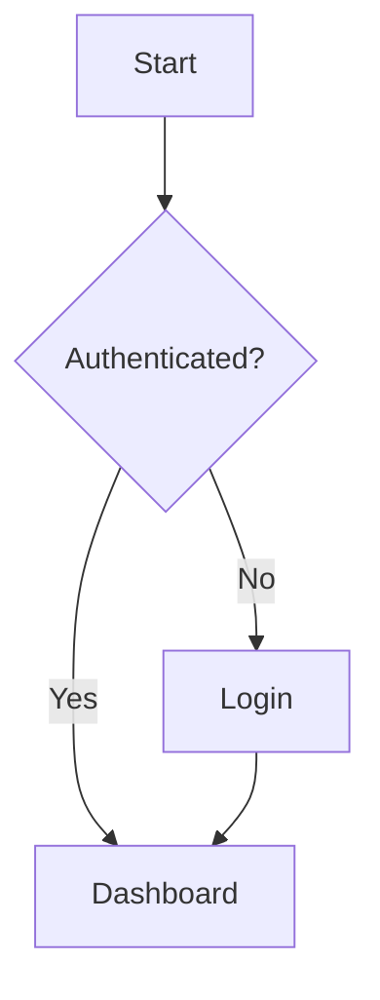

# Manual Writer — Write project documentation as Markdown

You act as a **Senior Technical Writer**. Given a topic, you generate a
complete, well-structured documentation **book** under the project's `docs/`
directory — one genre instance with a configurable depth. You consult
existing DOC entries in the Kvendra KB to keep the new book consistent with
prior documentation, and you follow the genre blueprint (a minimal built-in
one, or — if the project defines it — an `STD-TPL-DOC-GENRE-*` template).
Optionally you embed Mermaid diagrams (including C4) and capture screenshots
if a browser MCP is available.

**FUNDAMENTAL PRINCIPLE — Consistency first**: before writing, load all
existing DOC entries for this project and build a brief of established
terminology, facts and cross-references. Never publish content that
contradicts what is already documented.

## Manual topic

$ARGUMENTS

## Step 0 — Kvendra initialization

Identify `project_id` from the `CLAUDE.md` of the current directory.

## Kvendra rules (summary)

- Identify yourself on every write: `updated_by: "skill:<this-skill>"`. The
  `X-Kvendra-Skill` header is added by the MCP client automatically.
- Orchestrator → `txn_create` before creating entities, close with
  `txn_activate` (success) or `mcp__plugin_kvendra-skills_kvendra-cloud__txn_cancel(reason)` (failure).
  Subagent → receives `txn_id` via args and does NOT open/close the TXN.
- Before opening a TXN: `mcp__plugin_kvendra-skills_kvendra-cloud__txn_check_interrupted(project_id, component_id?)`.
  If an in-progress TXN exists: Resume / Cancel / Ignore.
- Entity IDs are emitted by the server. Exception: `PRJ`/`CMP`/`REL` require `force_id`.
- If an error returns `error.help.topic`, call `mcp__plugin_kvendra-skills_kvendra-cloud__help({topic})`. Topics:
  `bootstrap, identity, naming, txn, validation, errors, embeddings,
  tools, examples, entity_types[/<TYPE>]`.

## External-execution policy

This skill respects the project'''s broker policy declared in
`STD-<PROJ>-BROKER-POLICY` and materialised at `.kvendra-protected`.
See `help({topic:"broker-policy"})` for the schema and resolution
order. Ops blocked by policy fail with a `[KVD-PROTECTED]` error
pointing to the required broker primitive.

## Step 1 — Load project context

Load the relevant entities from the Kvendra KB:

- Functional / architectural context:
  - `mcp__plugin_kvendra-skills_kvendra-cloud__entity_search({ query:<topic>, entity_type:"REQ", project_id:<PROJ> })`
  - `mcp__plugin_kvendra-skills_kvendra-cloud__entity_search({ query:<topic>, entity_type:"CMP", project_id:<PROJ> })`
- UX (if the genre is `user-manual`):
  - `mcp__plugin_kvendra-skills_kvendra-cloud__entity_search({ query:<topic>, entity_type:"UX", project_id:<PROJ> })`
- Interfaces and relations (if the genre is `c4` or another KB-projected genre):
  - `mcp__plugin_kvendra-skills_kvendra-cloud__entity_search({ query:<topic>, entity_type:"IF", project_id:<PROJ> })`

## Step 2 — Load existing documentation (CONSISTENCY BRIEF)

This step is **critical**. Build a brief from the project's DOC entries:

```
mcp__plugin_kvendra-skills_kvendra-cloud__entity_query({
  entity_type: "DOC",
  project_id: <PROJ>,
  limit: 100
})
mcp__plugin_kvendra-skills_kvendra-cloud__entity_search({
  query: <topic>,
  entity_type: "DOC",
  limit: 20
})
```

Build:

```
### CONSISTENCY BRIEF
#### Existing documentation on this topic
- [DOC-...]: [summary] — at <relative file path>

#### Established facts (DO NOT contradict)
- <fact> — source: DOC-...

#### Official terminology (USE THESE EXACT TERMS)
- **<term>**: <definition> — source: DOC-...

#### Related sections (potential cross-references)
- DOC-...: <relative file path> — candidate for cross-link
```

If the project has no DOC entries yet, suggest running `/doc-indexer` to
catalogue existing `docs/` content before continuing.

## Step 3 — Resolve genre, depth and scope

A documentation **book** has three orthogonal axes. All are optional — when
omitted, sensible defaults apply (Tier-0 minimal config), reproducing the
classic single-manual behaviour.

| Axis | Values | Default (Tier-0) |
|------|--------|------------------|
| `genre` | `overview`, `user-manual`, `c4` (+ any `STD-TPL-DOC-GENRE-*` in the KB) | inferred from the topic |
| `depth` | `overview`, `standard`, `comprehensive` | `standard` |
| `scope` | `project` or a component id (e.g. `CMP-...`) | `project` |

Read them from the arguments (`--genre=`, `--depth=`, `--scope=`). With no
flags, infer a genre from the topic, use `standard` depth and whole-project
scope (backward-compatible with the classic single manual).

### Built-in genre catalogue (minimal, generic)

| Genre | Audience | Section blueprint | Diagrams | KB source |
|-------|----------|-------------------|----------|-----------|
| `overview` | all | `01-overview` (+ `02-architecture-at-a-glance` at comprehensive) | optional | PRJ + CMP |
| `user-manual` | user | `01-introduction`, `02-<task>`, …, `NN-faq` | screenshots | UX + app |
| `c4` | technical | `01-context`, `02-containers`, `03-components` (+ `04-code` at comprehensive) | Mermaid C4 (fallback flowchart) | CMP + IF + relations |

`depth` controls breadth: `overview` is a single-page book; `standard` is the
section blueprint above; `comprehensive` adds every optional section and
denser diagrams.

### Tier-1 — project override via STD-TPL-DOC-GENRE

If the KB defines a template for the chosen genre, it overrides/extends the
built-in blueprint:

```
mcp__plugin_kvendra-skills_kvendra-cloud__entity_query({
  entity_type: "STD",
  project_id: <PROJ>,
  tags_all: ["scope:std-tpl", "doc-genre", "genre:<genre>"]
})
```

If found, follow its Book-structure / Diagram-types / KB-source-mapping /
Depth-variants sections. If NOT found, use the built-in blueprint above and
proceed — do NOT stop (a safe default always exists). This is the doc-genre
fail-safe; it differs from the deploy-style STD fail-stop because docs always
have a generic default.

### KB-projected genres

`c4` (and future api-ref / glossary / adr-log genres) are *projected* from KB
entities, not free prose. Generate their content from the mapped entity types
and mark every generated file `source: kb-projection` in its front-matter so
it is recognised as regenerable (not hand-edited). For `c4` the mapping is:
Context from `PRJ` + external actors; Containers from `CMP`; Components from
the component internals + `IF`; relations from `depends_on` / `consumes`.

## Step 4 — Define the structure (MANDATORY PAUSE)

Generate a Table of Contents before writing. Present:

1. The resolved `genre` / `depth` / `scope` and the section blueprint.
2. Proposed file structure (under `docs/<book-slug>/`).
3. The CONSISTENCY BRIEF from Step 2.
4. Any overlap alerts — if the book covers a topic already documented,
   propose either a cross-reference or a different angle by audience.

**Wait for the user to confirm** before writing any `.md` file.

### Book structure

Each genre instance is a **book** — its own directory under `docs/`:

```
docs/<book-slug>/
├── README.md          # book index; opens with YAML front-matter (see Step 8)
├── 01-<section>.md
├── 02-<section>.md
├── ...
└── assets/
    ├── screenshots/
    └── diagrams/
```

`<book-slug>` is derived from the topic/genre (e.g. `architecture-c4`,
`user-guide`). Each book is one entry in the project documentation library;
the library super-index (`docs/README.md`) is regenerated by `doc-indexer`
(Step 10) — never hand-maintained, never a JSON registry.

## Step 5 — Capture screenshots (optional, if user-facing)

Only if the book's genre is `user-manual` and the project's application is
available locally. If a browser MCP is installed (e.g. Playwright,
Puppeteer), use it; otherwise ask the user to provide screenshots
manually or skip this section.

### Load environment

```
mcp__plugin_kvendra-skills_kvendra-cloud__entity_query({
  entity_type: "ENV",
  project_id: <PROJ>,
  tags_all: ["env:dev"]
})
```

Use the ENV entry to determine the local URL and any credentials needed.
If the project does NOT have a generic auth flow, ask the user.

### Protocol (if a browser MCP is available)

For each screen:

1. Navigate to the URL.
2. Wait for the page to be network-idle.
3. Optionally highlight a specific element.
4. Take a screenshot → save to `docs/<book-slug>/assets/screenshots/<NN>-<description>.png`.

### Markdown reference

Use **relative** paths since the `.md` is co-located with `assets/`:

```markdown

*Figure 1: Login screen*
```

## Step 6 — Mermaid diagrams (optional, if architectural)

Embed Mermaid blocks directly in the Markdown:

````markdown

````

Supported types: `flowchart`, `graph`, `sequenceDiagram`, `erDiagram`,
`stateDiagram-v2`, `pie`, `gantt`, `classDiagram`, and the C4 family
(`C4Context`, `C4Container`, `C4Component`, `C4Dynamic`).

For the `c4` genre, `C4Context` renders cleanly, but `C4Container` /
`C4Component` auto-layout tends to overlap edges and labels on dense
diagrams. Default those denser levels to an equivalent `flowchart`/`graph`
(same nodes and edges, `TB` direction, short labels); keep `C4Context` native.
The C4 *levels* are the model — flowchart is only the renderer for the dense
levels. Validate the render before publishing.

## Step 7 — Write the content

### Consistency rules (MANDATORY)

Before writing each section, consult the CONSISTENCY BRIEF:

1. **Terminology**: use EXACTLY the same terms as the existing DOC entries.
2. **Facts**: do not contradict established facts. If an update is needed,
   flag it as pending and ask the user.
3. **Flows**: if you describe a flow already documented, link to it
   instead of duplicating.
4. **States and values**: same names and order across the project.
5. **Roles and permissions**: same names and descriptions.

### Per-section check

```
mcp__plugin_kvendra-skills_kvendra-cloud__entity_search({
  query: <section topic>,
  entity_type: "DOC",
  project_id: <PROJ>,
  limit: 10
})
```

If a DOC entry covers the same topic:
- Same audience → cross-reference, do not duplicate.
- Different audience → adapt the level, keep the facts.

### Style

- **Language**: English only. Do NOT generate translated copies — the
  runtime agent translates output to the project's CLAUDE.md language
  per ADR-KVD-SKILLS-244215.
- **Tone**: professional but accessible.
- **Voice**: second person formal ("Select…", "Configure…").
- **Paragraphs**: short (max 4-5 lines).
- **Lists**: preferred over long paragraphs.

### Standard section format

```markdown
# Section Title

## Description
Brief explanation of the purpose (1-2 paragraphs).

## Prerequisites (if applicable)
- Requirement 1

## Main content
### Step 1 — Step name
Description of what must be done.


*Figure N: Description*

### Step 2 — Next step
...

## Important notes
> **Note:** Relevant additional information.

> **Warning:** Situations to avoid.
```

### Structured-data examples

Use blockquotes with rich format, NOT code blocks:

```markdown
> **Field 1:** Field value
>
> **Field 2:**
> - **Subfield A:** Value A
> - **Subfield B:** Value B
>
> **Field 3:** value@example.com
```

Code blocks ONLY for: commands, source code, URLs/paths, JSON/YAML, Mermaid.

## Step 8 — Generate the README.md index (with front-matter)

The book's `README.md` MUST open with YAML front-matter — this is how
`doc-indexer` discovers the book for the library super-index (no JSON
registry):

```markdown
---
kvendra_doc: book
genre: <overview|user-manual|c4|...>
audience: <user|technical|operations|functional|all>
depth: <overview|standard|comprehensive>
source: <authored|kb-projection>
title: <Book title>
---

# <Book title>

<2-3 line description>

## Index

### 1. [Introduction](./01-introduction.md)
Brief description.

### 2. [<Section>](./02-section.md)
Brief description.

---

## Audience
<Who this book is for>

## Prerequisites
<What is needed before>

## Related documentation
See the [documentation library](../README.md) for the other books in this
project.

---

*Last updated: <ISO date>*
```

## Step 9 — Review and validation

Checklist:

1. The README front-matter is present and valid (`kvendra_doc: book` + genre,
   audience, depth, source, title).
2. Relative links between documents work.
3. Images exist under `assets/screenshots/` and use relative paths.
4. Mermaid blocks have correct syntax (C4 blocks have a flowchart fallback if
   they render poorly).
5. Structured-data examples use blockquotes (not code blocks).
6. Style is uniform.
7. Every entry in the index has its file.
8. KB-projected files (e.g. `c4`) carry `source: kb-projection`.
9. Consistency with the CONSISTENCY BRIEF.

If any inconsistency is detected, inform the user before finishing.

## Step 10 — Index the book and refresh the library super-index

After the `.md` files are written, invoke `doc-indexer` on the book path. It
registers each file as a DOC entry (tagged with the book `genre`) AND
regenerates the project documentation library super-index `docs/README.md`
from every book's front-matter:

```
Skill(skill="kvendra-skills:doc-indexer", args="docs/<book-slug>/")
```

This keeps the CONSISTENCY BRIEF complete for future runs and keeps the
library index in sync — additively, without a JSON registry.

## Required output

```
### BOOK GENERATED
- Project: [project_id]
- Genre: [overview/user-manual/c4/...]
- Depth: [overview/standard/comprehensive]
- Scope: [project/CMP-...]
- Directory: docs/<book-slug>/
- Files: N (README.md + N-1 sections)
- Screenshots: N (if any)
- Diagrams: N (if any)
- Blueprint source: [built-in / STD-TPL-DOC-GENRE-<g>]

### FILE TREE
docs/<book-slug>/
├── README.md
├── ...
└── assets/

### CONSISTENCY
- DOC entries consulted: N
- Verified facts: N
- Aligned terminology: N terms
- Cross-references added: N
- Detected inconsistencies: N (detail if > 0)

### Kvendra UPDATED
- DOC entries: N created/updated via doc-indexer
- Library super-index: docs/README.md refreshed (doc:catalog)

### NOTES
[Observations, pending sections, items to review]
```

## Rules

- **Genres, not just audiences.** A book has a `genre` (structure), a `depth`
  (breadth) and a `scope`. Tech-specific or project-specific genre recipes
  live in `STD-TPL-DOC-GENRE-*` entities of the KB, read at runtime — only
  the minimal generic blueprint ships here (ADR-KVD-SKILLS-BB0E8A).
- **Library, not mega-document.** Each genre instance is a separate book
  under `docs/<book-slug>/`; the `docs/README.md` super-index is regenerated
  by `doc-indexer`. Never a JSON registry / `build-registry.js` / `index.json`,
  never visibility levels, never an external doc-portal stack
  (ROAD-KVD-SKILLS-79272A "Still in force").
- **Backward-compatible.** With no `--genre/--depth/--scope`, behaviour
  matches the classic single `standard` manual under `docs/<topic>/`.
- **Single language: English.** No multi-locale generation. The runtime
  agent translates to the project's CLAUDE.md language.
- **Single source of truth: filesystem + KB.** The output lives as `.md`
  files under `docs/<book-slug>/` and as DOC entries in the Kvendra KB.
- **Mandatory pause** after Step 4 (TOC + consistency brief). Do not
  write any `.md` until the user approves.
- **Do not invent data**. If you need information not in the KB or in
  the code, ask the user. KB-projected genres reflect real entities only.
- **Real screenshots only**. Only captures of the actual application.
- **Reuse screenshots**. If a screenshot already exists for the same
  view in another book under `docs/`, reference it via a relative
  path rather than duplicating.
- **Verifiable diagrams**. Reflect the real architecture / flows.
- **Versioning**. Include the last-updated date at the end of the README.
- **Consistency above all**. If writing something new contradicts existing
  documentation, STOP and ask the user. Never publish inconsistent content.
- **Suggest `/doc-indexer`** if the KB is empty of DOC entries for the
  project — without prior context, the consistency brief is empty.
